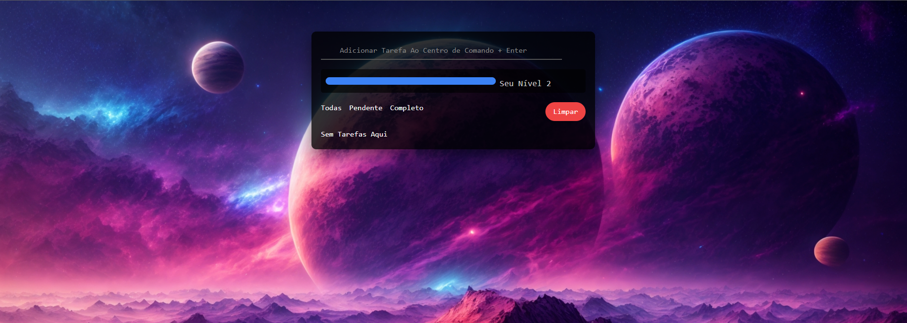

# Todo RPG Game

O Todo RPG Game é uma aplicação simples baseada em tarefas (to-do list) com um toque de gamificação. Ele permite que você gerencie suas tarefas diárias enquanto ganha experiência e sobe de nível, tornando a realização de tarefas mais divertida e motivadora.

## Funcionalidades Principais

- Adicionar tarefas à lista do Centro de Comando.
- Marcar tarefas como pendentes ou completas.
- Ganhar experiência ao completar tarefas.
- Acompanhar o progresso através de uma barra de experiência e níveis.
- Filtrar tarefas por status (todas, pendentes, completas).
- Limpar todas as tarefas concluídas.

## Como Usar

1. Digite sua tarefa na caixa de entrada e pressione Enter para adicioná-la.
2. Marque as tarefas como completas para ganhar experiência.
3. Acompanhe seu progresso na barra de experiência e níveis.
4. Use os botões de filtro para visualizar diferentes categorias de tarefas.

## Instalação

1. Clone o repositório: `git clone https://github.com/Gabriel-Borgess/todo-game.git`
2. Abra o arquivo `index.html` em um navegador da web.
